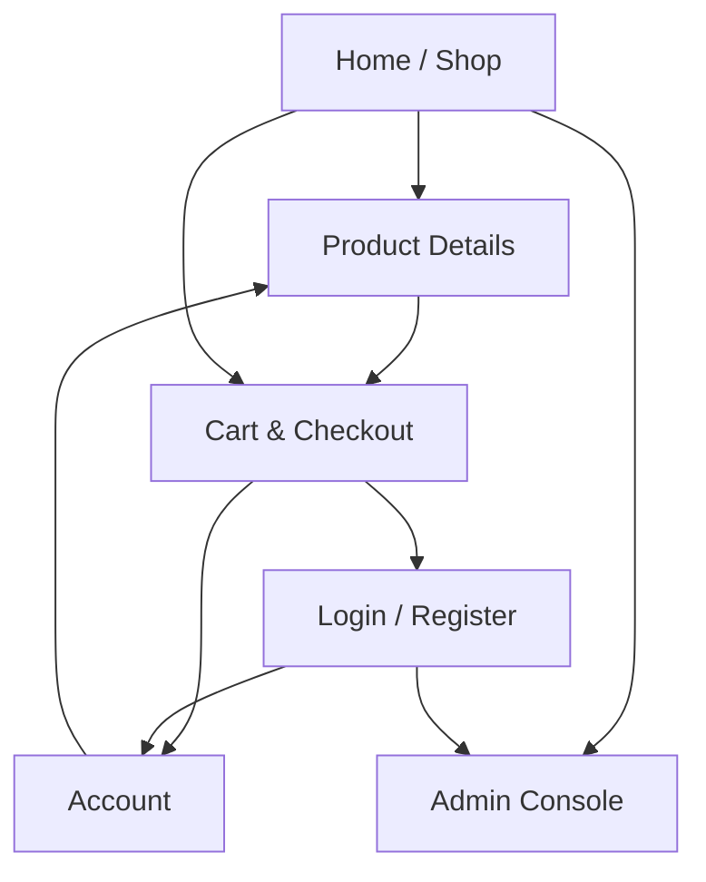

## 1. Product Overview
EUNOS EcoGear is a desktop-first e-commerce site for browsing and buying eco-friendly outdoor gear.
It supports customer accounts, an admin catalog console, and a simulated payment flow for testing.

## 2. Core Features

### 2.1 User Roles
| Role | Registration Method | Core Permissions |
|------|---------------------|------------------|
| Shopper (Guest/Customer) | Guest browsing; Email + password sign-up/login | Browse products; manage cart; checkout; view own orders |
| Admin | Manually granted role by setting profile role | Create/update products & categories; manage orders; publish/unpublish items |

### 2.2 Feature Module
Our e-commerce requirements consist of the following main pages:
1. **Home / Shop**: header navigation, category browsing, product grid, search/sort.
2. **Product Details**: product media, pricing, variants (if any), add-to-cart.
3. **Cart & Checkout**: cart editing, shipping info, order review, simulated payment.
4. **Login / Register**: email authentication, password reset.
5. **Account**: profile basics, address book (optional), order history & order details.
6. **Admin Console**: product/category CRUD, inventory/status toggles, order management.

### 2.3 Page Details
| Page Name | Module Name | Feature description |
|-----------|-------------|---------------------|
| Home / Shop | Header + navigation | Navigate to categories, account, cart, admin (admin-only link). |
| Home / Shop | Product discovery | List products; filter by category; search by name; sort by price/newest. |
| Home / Shop | Product cards | Open product details; show price, primary image, stock badge. |
| Product Details | Product viewer | Display images, title, description, price, availability. |
| Product Details | Add to cart | Select quantity; add/update cart item; show confirmation. |
| Cart & Checkout | Cart editor | View items; change quantity; remove items; compute subtotal. |
| Cart & Checkout | Checkout form | Collect email (if guest -> prompt login), shipping address, delivery notes. |
| Cart & Checkout | Order creation | Create order and order items from cart; lock pricing snapshot. |
| Cart & Checkout | Payment simulation | Simulate “Pay now”; mark order as paid; generate fake transaction id; show receipt page state. |
| Login / Register | Auth forms | Register/login with email+password; handle errors; reset password flow. |
| Account | Order history | List your orders; open an order detail view (items, totals, status, payment id). |
| Account | Profile basics | Show email/name; allow updating display name. |
| Admin Console | Catalog management | Create/edit products/categories; upload product images; publish/unpublish; set stock count. |
| Admin Console | Order management | View all orders; set fulfillment status (e.g., pending/fulfilled/refunded-simulated). |

## 3. Core Process
**Shopper Flow**: Browse products → open a product → add to cart → review cart → enter shipping details → place order → simulate payment → view receipt/order in Account.

**Admin Flow**: Login → open Admin Console → create/update products/categories and images → monitor orders → update fulfillment statuses.

