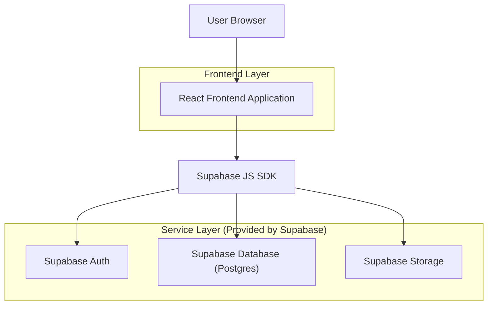

## 1.Architecture design


## 2.Technology Description
- Frontend: React@18 + vite + tailwindcss@3
- Backend: Supabase (Auth + Postgres + Storage)

## 3.Route definitions
| Route | Purpose |
|-------|---------|
| / | Home / Shop (browse, search, category filters) |
| /product/:slug | Product details + add to cart |
| /cart | Cart review and editing |
| /checkout | Shipping form, order review, payment simulation |
| /auth/login | Login |
| /auth/register | Register |
| /account | Profile + your orders |
| /admin | Admin console (catalog + order management) |

## 6.Data model(if applicable)

### 6.1 Data model definition
**Auth & roles**
- profiles: user_id (auth.users.id), display_name, role ('customer'|'admin'), created_at

**Catalog**
- categories: id, name, slug, description, is_active
- products: id, name, slug, description, price_cents, currency, stock_qty, is_published, category_id (logical), created_at
- product_images: id, product_id (logical), storage_path, alt_text, sort_order

**Cart & orders**
- carts: id, user_id (logical, nullable for guest session id if used), status ('active'|'converted'), created_at
- cart_items: id, cart_id (logical), product_id (logical), qty, unit_price_cents_snapshot
- orders: id, user_id (logical), status ('pending_payment'|'paid'|'fulfilled'|'cancelled'), subtotal_cents, shipping_cents, total_cents, currency, shipping_name, shipping_address1, shipping_city, shipping_region, shipping_postal, shipping_country, created_at
- order_items: id, order_id (logical), product_id (logical), product_name_snapshot, qty, unit_price_cents_snapshot

**Simulated payment**
- payments: id, order_id (logical), user_id (logical), provider ('simulated'), status ('succeeded'|'failed'), transaction_ref, amount_cents, currency, created_at

### 6.2 Data Definition Language
Note: use logical foreign keys (no physical REFERENCES) unless you later decide otherwise.

```
-- PROFILES (role source)
CREATE TABLE profiles (
  user_id UUID PRIMARY KEY,
  display_name TEXT,
  role TEXT NOT NULL DEFAULT 'customer' CHECK (role IN ('customer','admin')),
  created_at TIMESTAMPTZ NOT NULL DEFAULT now()
);

-- CATALOG
CREATE TABLE categories (
  id UUID PRIMARY KEY DEFAULT gen_random_uuid(),
  name TEXT NOT NULL,
  slug TEXT UNIQUE NOT NULL,
  description TEXT,
  is_active BOOLEAN NOT NULL DEFAULT true
);

CREATE TABLE products (
  id UUID PRIMARY KEY DEFAULT gen_random_uuid(),
  name TEXT NOT NULL,
  slug TEXT UNIQUE NOT NULL,
  description TEXT,
  price_cents INTEGER NOT NULL CHECK (price_cents >= 0),
  currency TEXT NOT NULL DEFAULT 'USD',
  stock_qty INTEGER NOT NULL DEFAULT 0 CHECK (stock_qty >= 0),
  is_published BOOLEAN NOT NULL DEFAULT false,
  category_id UUID,
  created_at TIMESTAMPTZ NOT NULL DEFAULT now()
);

CREATE TABLE product_images (
  id UUID PRIMARY KEY DEFAULT gen_random_uuid(),
  product_id UUID NOT NULL,
  storage_path TEXT NOT NULL,
  alt_text TEXT,
  sort_order INTEGER NOT NULL DEFAULT 0
);

-- CARTS & ORDERS
CREATE TABLE carts (
  id UUID PRIMARY KEY DEFAULT gen_random_uuid(),
  user_id UUID,
  status TEXT NOT NULL DEFAULT 'active' CHECK (status IN ('active','converted')),
  created_at TIMESTAMPTZ NOT NULL DEFAULT now()
);

CREATE TABLE cart_items (
  id UUID PRIMARY KEY DEFAULT gen_random_uuid(),
  cart_id UUID NOT NULL,
  product_id UUID NOT NULL,
  qty INTEGER NOT NULL CHECK (qty > 0),
  unit_price_cents_snapshot INTEGER NOT NULL CHECK (unit_price_cents_snapshot >= 0)
);

CREATE TABLE orders (
  id UUID PRIMARY KEY DEFAULT gen_random_uuid(),
  user_id UUID NOT NULL,
  status TEXT NOT NULL DEFAULT 'pending_payment' CHECK (status IN ('pending_payment','paid','fulfilled','cancelled')),
  subtotal_cents INTEGER NOT NULL CHECK (subtotal_cents >= 0),
  shipping_cents INTEGER NOT NULL DEFAULT 0 CHECK (shipping_cents >= 0),
  total_cents INTEGER NOT NULL CHECK (total_cents >= 0),
  currency TEXT NOT NULL DEFAULT 'USD',
  shipping_name TEXT NOT NULL,
  shipping_address1 TEXT NOT NULL,
  shipping_city TEXT NOT NULL,
  shipping_region TEXT,
  shipping_postal TEXT,
  shipping_country TEXT NOT NULL,
  created_at TIMESTAMPTZ NOT NULL DEFAULT now()
);

CREATE TABLE order_items (
  id UUID PRIMARY KEY DEFAULT gen_random_uuid(),
  order_id UUID NOT NULL,
  product_id UUID NOT NULL,
  product_name_snapshot TEXT NOT NULL,
  qty INTEGER NOT NULL CHECK (qty > 0),
  unit_price_cents_snapshot INTEGER NOT NULL CHECK (unit_price_cents_snapshot >= 0)
);

CREATE TABLE payments (
  id UUID PRIMARY KEY DEFAULT gen_random_uuid(),
  order_id UUID NOT NULL,
  user_id UUID NOT NULL,
  provider TEXT NOT NULL DEFAULT 'simulated',
  status TEXT NOT NULL CHECK (status IN ('succeeded','failed')),
  transaction_ref TEXT NOT NULL,
  amount_cents INTEGER NOT NULL CHECK (amount_cents >= 0),
  currency TEXT NOT NULL DEFAULT 'USD',
  created_at TIMESTAMPTZ NOT NULL DEFAULT now()
);

-- SIMULATED PAYMENT: single call to atomically mark paid + create payment record
CREATE OR REPLACE FUNCTION simulate_payment(p_order_id UUID)
RETURNS UUID
LANGUAGE plpgsql
SECURITY DEFINER
AS $$
DECLARE
  v_user UUID;
  v_total INTEGER;
  v_currency TEXT;
  v_payment_id UUID;
  v_tx TEXT;
BEGIN
  SELECT user_id, total_cents, currency INTO v_user, v_total, v_currency
  FROM orders WHERE id = p_order_id;

  IF v_user IS DISTINCT FROM auth.uid() THEN
    RAISE EXCEPTION 'not_allowed';
  END IF;

  UPDATE orders SET status = 'paid'
  WHERE id = p_order_id AND status = 'pending_payment';

  v_tx := 'SIM-' || replace(gen_random_uuid()::text,'-','');

  INSERT INTO payments(order_id, user_id, status, transaction_ref, amount_cents, currency)
  VALUES (p_order_id, v_user, 'succeeded', v_tx, v_total, v_currency)
  RETURNING id INTO v_payment_id;

  RETURN v_payment_id;
END;
$$;
```

### Auth / Admin rules (Supabase)
- Authentication: Supabase Auth (email/password). Create a `profiles` row on first login via client-side upsert or DB trigger.
- Admin gate: `profiles.role = 'admin'`.
- RLS (high-level):
  - products/categories: anon can read only published/active; authenticated can read same; only admin can insert/update/delete.
  - carts/cart_items: authenticated can CRUD only where user_id = auth.uid(); guests can use localStorage-only cart if preferred.
  - orders/order_items/payments: authenticated can read own; only admin can read all and update fulfillment; `simulate_payment()` enforces ownership and pending status.

### Grants (baseline)
```
GRANT SELECT ON categories, products TO anon;
GRANT ALL PRIVILEGES ON categories, products, carts, cart_items, orders, order_items, payments, profiles TO authenticated;
```
